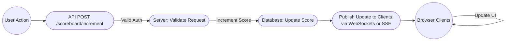

# README.md

## Overview

This module manages the **live updating** of a scoreboard showing the top 10 users by score. A “score” is incremented each time a user completes a particular action (the nature of that action is not relevant here). We also need to prevent unauthorized score tampering.

Key functionalities:

1. **Display a live scoreboard** of the top 10 users by score.  
2. **Increment user score** upon completion of a valid action.  
3. **Secure** the API calls so only legitimate score increments are honored.  

## Goals

- **Real-Time Updates**: The scoreboard should update for all connected clients whenever a user’s score changes.  
- **Scalability**: The solution should handle multiple concurrent requests/updates.  
- **Security**: Only valid, authenticated requests should result in a score increment.

## Assumptions & Constraints

1. **Authentication**: We assume a valid authentication mechanism already exists (e.g., **JWT tokens**, session cookies, or API keys). The user’s identity is known to the backend.  
2. **Data Storage**: Scores are stored in a **persistent** data store (e.g., PostgreSQL, Redis, or any other DB).  
3. **Transport**: We can use WebSockets, Server-Sent Events (SSE), or polling to achieve real-time scoreboard updates on the front end.  
4. **Performance**: Top 10 scoreboard queries should be optimized.  

## High-Level Flow

1. **User completes an action** on the front end.  
2. A **secured request** is dispatched to the server’s **“increment score”** endpoint (e.g., with a **JWT** in the `Authorization` header).  
3. **Server validates** the request (checks JWT, verifies user identity, etc.).  
4. **Server increments** the user’s score in the database.  
5. **Server triggers** a scoreboard update event to all connected clients (via WebSocket/SSE or an event bus).  
6. **Clients** receive the **updated scoreboard** data and re-render the scoreboard in real time.

## Endpoints (Conceptual)

1. **`GET /api/scoreboard`**  
   - **Purpose**: Fetch the top 10 users by score.  
   - **Response**: JSON array of user objects, each containing `userId`, `username`, `score`, etc.  
   - **Authentication**: May or may not require user-level auth (depending on privacy needs).  

2. **`POST /api/scoreboard/increment`**  
   - **Purpose**: Increment a user’s score after an action.  
   - **Request Body**:  
     ```json
     {
       "actionId": "<action identifier>", 
       "userId": "<id of the user to increment>"
     }
     ```  
   - **Security**:  
     - **Auth required**: e.g., a **JWT** in the `Authorization` header, or session-based.  
     - **Server-side checks** to confirm:
       1. The `userId` matches the authenticated user, or  
       2. The action is otherwise authorized.  
   - **Response**:  
     - On success:  
       ```json
       {
         "status": "success",
         "newScore": <new user score>
       }
       ```
     - On failure / unauthorized: appropriate HTTP error (e.g., `401`, `403`, or `400`).

## Live Update Strategy

- **Option 1**: **WebSockets**  
  - Each client establishes a WebSocket connection to the server.  
  - When a score changes, the server emits a “SCORE_UPDATE” event with new scoreboard data.  
- **Option 2**: **SSE (Server-Sent Events)**  
  - Each client opens an SSE connection.  
  - The server pushes scoreboard updates as text/event-stream data.  
- **Option 3**: **Polling**  
  - Simpler to implement but less real-time. Clients periodically request updated scoreboard data (e.g., every 5 seconds).  

**Recommended approach** for real-time performance: **WebSockets** or **SSE**.

## Security Considerations

1. **Authentication**: Verify the user’s **JWT** or other auth credentials before incrementing any score.  
2. **Action Validation**: Potentially check if the user’s action is legitimate (if you have an internal queue/event log verifying the action).  
3. **Rate Limiting**: Consider limiting the rate of calls to `POST /api/scoreboard/increment` to prevent automated score inflation.  
4. **Transport Security**: Use **HTTPS/TLS** for all communications to prevent man-in-the-middle attacks.

## Additional Comments for Improvement

1. **Audit Logs**: Keep a record of each increment in an audit table or log for debugging or dispute resolution.  
2. **Leaderboard Caching**: If the scoreboard is extremely popular, you could cache the top 10 users in memory (e.g., Redis) and invalidate or update that cache whenever a score changes. This prevents repeated heavy queries on the DB.  
3. **Distributed Setup**: If the system grows, ensure your real-time broadcasting can scale horizontally (using a message broker like Redis pub/sub, RabbitMQ, etc. for cross-instance communication).  
4. **JWT Expiration & Refresh**: Ensure tokens are short-lived and can be refreshed via a secure refresh mechanism to reduce the window of compromise if a token is stolen.

---

# Diagram: Execution Flow



### Explanation

1. **A**: User performs an in-app action.  
2. **B**: The frontend sends a `POST` request to the `/api/scoreboard/increment` endpoint (with JWT or session).  
3. **C**: The server checks authentication and ensures the user is allowed to increment the score.  
4. **D**: If valid, the server increments the user’s score in the database.  
5. **E**: The server publishes an update event (e.g., via WebSocket).  
6. **F**: All connected clients receive the updated scoreboard data and refresh the display.

---

## Final Notes

This specification outlines the desired functionality for a live scoreboard module, focusing on real-time updates and secure score increments. The **backend engineering** team can implement the details (e.g., the choice of real-time technology, database schema, caching, and JWT-based auth specifics) using this guide.  

**End of Specification**